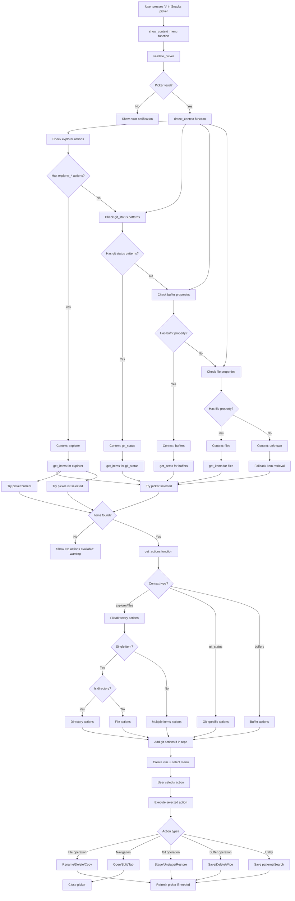
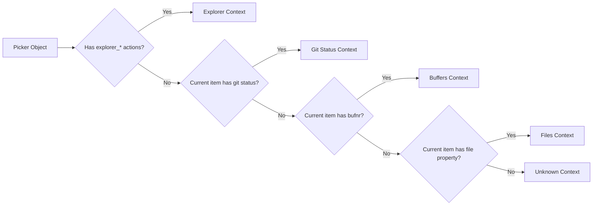
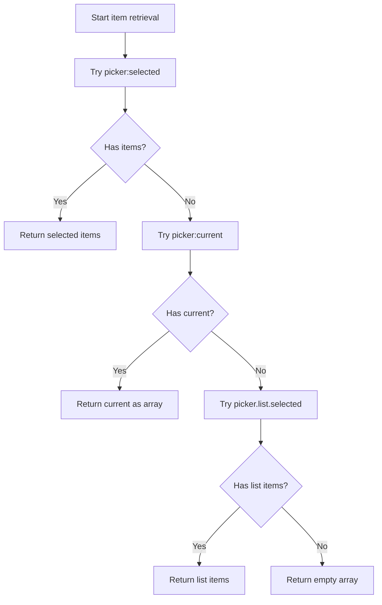

# Snacks.nvim Picker Context Menu System

## Overview
This document describes the data flow and architecture of the context menu system for Snacks.nvim pickers, activated by pressing "b" in any picker.

## Data Flow Diagram

## Context Detection Strategy

### Primary Detection (Capability-based)
Since `picker.opts.source` is unreliable (often `nil`), we use capability-based detection:

### Item Retrieval Hierarchy
For each context, items are retrieved using this fallback chain:

## Action Categories

### Explorer/Files Context
- **Single File**: Open, split, rename, delete, copy path, save patterns
- **Single Directory**: Open, explore, terminal, rename, delete, new file/dir
- **Multiple Items**: Delete all, copy paths, open all files, save patterns
- **Git Actions**: Add, restore (if in git repo)

### Git Status Context
- **Stage/Unstage**: Toggle staging status based on current state
- **Restore**: Restore files to HEAD state
- **Diff**: Show git diff in split
- **Save Patterns**: Run formatting on changed files

### Buffers Context
- **Delete**: Close buffer (with confirmation)
- **Wipe**: Force close buffer
- **Save**: Write buffer to disk
- **Save Patterns**: Run formatting on buffer content

## Key Technical Solutions

### Problem: Source Field Unreliable
- **Issue**: `picker.opts.source` often returns `nil`
- **Solution**: Detect context by examining available actions and item properties

### Problem: Empty Item Lists
- **Issue**: `picker:selected()` returns `{}` instead of `nil` when no selection
- **Solution**: Check `#selected > 0` and implement fallback chain

### Problem: Different Picker Behaviors
- **Issue**: Different pickers expose items differently
- **Solution**: Unified `get_items` function with multiple fallback strategies

## Files Modified
- `lua/utils/picker-extensions.lua` - Main implementation
- `lua/plugins/snacks.lua` - Key binding configuration (`["b"]` mapping)

## Usage
Press `b` in any Snacks.nvim picker to open the context menu with appropriate actions for the current context and selected/current items.